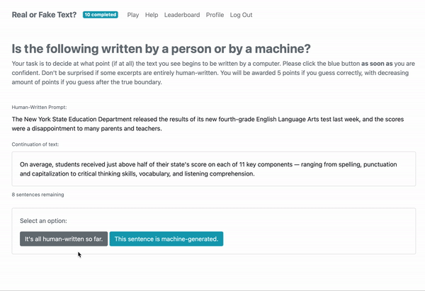

# RoFT: Real or Fake Text? 
> Can you detect AI written text? Test your skills at <a href="http://roft.io" text>roft.io</a>!

(Read <a href="https://arxiv.org/abs/2010.03070" text>our demo paper</a>
at EMNLP 2020 for more on our methodology.)

# Project Goal
In this project, we aim to measure how good neural langauge models are at writing text. If you're familiar with the Turing Test, RoFT is a very similar experiment!

We hope that by testing how good humans are at detecting text we can better understand what makes text sound "human".

## How does it work?
1. View text *one sentence at a time*.
2. Determine **when** the text switches from human written text to machine-generated text.
3. Recieve points according to your precision.
4. Climb the leaderboard and see how good you are at detecting generated text!

## Research Questions
1. How reliably can humans detect generated text?
2. Can we train humans to detect genrated text?
3. How does the size of model affect human detection accuracy?
4. How does the length of prompt affect human detection accuracy?
5. How does the genre of prompt text affect human detection accuracy?
6. How does the sampling strategy used for generation affect human detection accuracy?
7. How does fine-tuning affect human detection accuracy?
8. How do control codes for conditional generative models affect human detection accuracy?

## Data Sources
1. [New York Times Annotated Corpus (Sandhaus, 2008)](https://catalog.ldc.upenn.edu/LDC2008T19)
2. [Reddit Writing Prompts (Fan et al., 2018)](https://dl.fbaipublicfiles.com/fairseq/data/writingPrompts.tar.gz)
3. [Corpus of Presidential Speeches (Brown, 2016)](http://www.thegrammarlab.com/?nor-portfolio=corpus-of-presidential-speeches-cops-and-a-clintontrump-corpus)
4. [Recipe1M+ (Marin et al., 2019)](http://pic2recipe.csail.mit.edu/)

## Language Models
1. [GPT2 (Radford et al., 2019)](https://openai.com/blog/better-language-models/)
2. [GPT2-XL (Radford et al., 2019)](https://openai.com/blog/better-language-models/)
3. [CTRL (Keskar et al., 2019)](https://blog.einstein.ai/introducing-a-conditional-transformer-language-model-for-controllable-generation/)

## Citation
If you use the RoFT tool for your research, please cite us as:
<pre>
@article{dugan2020roft,
  title={RoFT: A Tool for Evaluating Human Detection of Machine-Generated Text},
  author={Dugan, Liam and Ippolito, Daphne and Kirubarajan, Arun and Callison-Burch, Chris},
  booktitle={Empirical Methods in Natural Language Processing, Demo Track},
  year={2020}
}
</pre>
